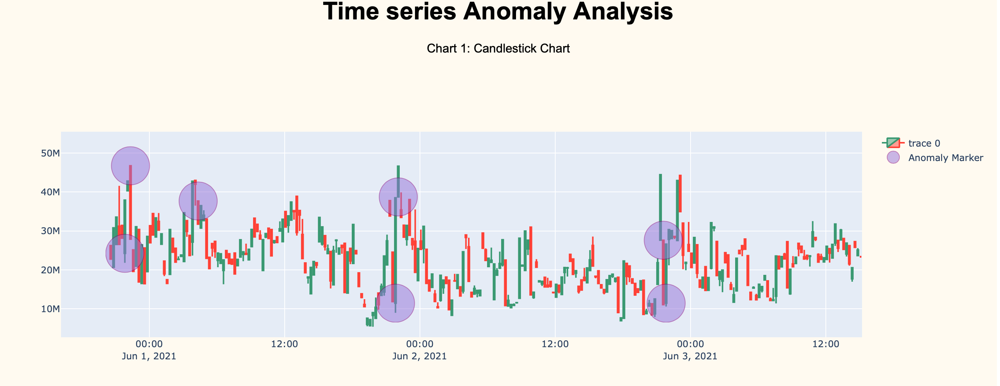
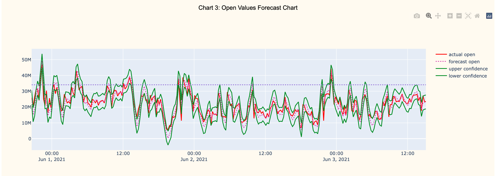

## Using candlestick charts to identify network anomalies in timeseries data

This simple script analyzes nomalies and outliers inside a time series, using candlestick charts.
The forecasting algorithm has been based on (double) exponential moving average.
Monitoring candlestick values (open, close, and volume) allows us to find anomalies even in
noisy datasets.

### How does the algorithm work?

To forecast anomalies, simple and double exponential smoothing functions have been implemented.
Each value of the candle is forecasted by an ewm function and confidence bands are created. Data are stored inside
a pandas dataframe. It is possible to tune algorithm "sensitivity". An anomaly is detected if more than or equal
```threshold``` params are out of forecasted confidence bands for a single candle; 
furthermore, anomaly is confirmed if one of the actual params is out of the 95th percentile.

Tuning parameters can be specified inside ```config.json``` file in the root directory.

At the end of the analysis, found anomalies details are printed to the terminal and plotted to a plotly web app in order
to be visualized by the user.

### Screenshots
Candlestick chart with anomalies markers:



Data forecasting example chart:



### Installation instructions

This project requires python 3.9 installed on your local machine and the package virtualenv.
Once you have installed python, open a terminal (on Linux/MacOS) window and type the following commands
in order to install dependencies.

```bash
    $ virtualenv timeseries-anomaly-venv
    $ source timeseries-anomaly-venv/bin/activate
    $ pip3 install -r requirements.txt  
```

Now, you can edit the ```config.json``` with all the parameters you need for your dataset.

To run the script type:
```bash
    $ python3 main.py
```

